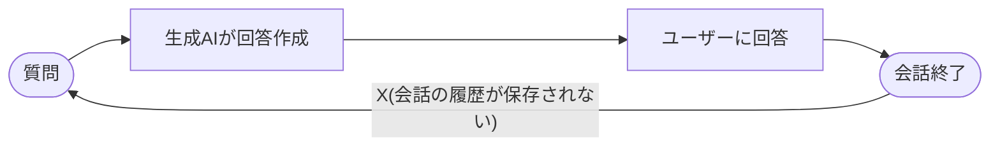
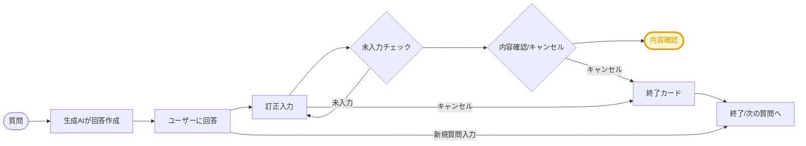
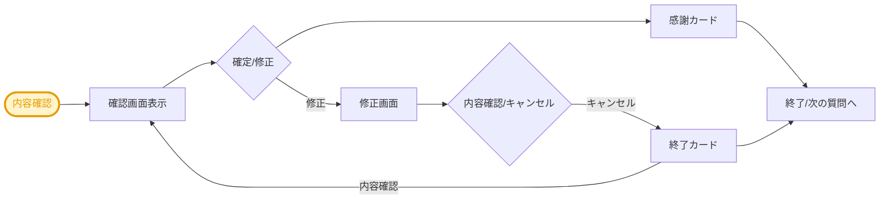

# モノマーGPTのフィードバック機能の設計書兼仕様書 <!-- omit in toc -->

        

---

**プロジェクト名:** RAG‑FB技術開発プロジェクト  
**サービス名:** モノマーGPT  
**環境:** Development (開発環境)   
**エージェント名:** TakasagoMonomer‑Dev  
> **本サービスの詳細：**  
> ・モノマー課の業務に特化した生成AIサービスにフィードバック機能を新たに搭載  
> ・現行機能を維持しつつ、フィードバック機能に合わせて一部の機能を修正  
> ・修正の内容は、本資料の「追加＆修正機能」で記述

---

**作成者:** アバナード株式会社  
**作成日:** 2025‑07‑31 

---

## 更新履歴 <!-- omit in toc -->

*要約 : 本資料の更新履歴です。*

| バージョン | 作成者         | 日付       | 更新対象 | 更新内容    | 備考     |
|------------|----------------|------------|---------|-------------|----------|
| 1.0        | AVAジョン       | 2025/07/16 | 初版    | 新規作成     | —        

## 目次

*要約 : 本資料の目次です。*
- [目次](#目次)
- [用語定義](#用語定義)
- [機能の流れ](#機能の流れ)
  - [現行](#現行)
  - [改善案](#改善案)
- [追加＆修正機能の詳細](#追加修正機能の詳細)
  - [No. 1 – フォールバック（Fallback）](#no-1--フォールバックfallback)
    - [修正前（現行）](#修正前現行)
    - [設定の詳細](#設定の詳細)
    - [修正後](#修正後)
    - [設定の詳細](#設定の詳細-1)
      - [修正のポイント](#修正のポイント)
  - [No. 2 – 会話の強化(Conversational Boosting)](#no-2--会話の強化conversational-boosting)
    - [修正前（デフォルト値）](#修正前デフォルト値)
    - [設定の詳細](#設定の詳細-2)
    - [修正後](#修正後-1)
    - [設定の詳細](#設定の詳細-3)
      - [修正のポイント](#修正のポイント-1)
    - [AdaptiveCardの設定](#adaptivecardの設定)
    - [AdaptiveCard設定の詳細](#adaptivecard設定の詳細)
      - [設定のポイント](#設定のポイント)
  - [No. 3 – フィードバック](#no-3--フィードバック)
    - [設定の詳細](#設定の詳細-4)
    - [AdaptiveCardの設定 1/2](#adaptivecardの設定-12)
    - [AdaptiveCard設定の詳細](#adaptivecard設定の詳細-1)
      - [設定のポイント](#設定のポイント-1)
    - [AdaptiveCardの設定 2/2](#adaptivecardの設定-22)
    - [AdaptiveCard設定の詳細](#adaptivecard設定の詳細-2)
      - [設定のポイント](#設定のポイント-2)
- [トピック単体テスト](#トピック単体テスト)
  - [テストの目的](#テストの目的)
  - [テスト項目](#テスト項目)

## 用語定義

*要約 : 本資料で登場する用語を整理した内容です。*

| No | 用語                 | 説明 |
|----|----------------------|------|
| 1  | **Copilot Studio**   | エージェントとエージェント フローを視覚的かつローコードで構築できる Microsoft の開発プラットフォームです |
| 2  | **トピック (Topic)** | Copilot Studio 内で、会話の単位や質問に対応する「会話の流れ」を定義する構成要素です |
| 3  | **Adaptive Card**    | JSON 形式で記述し、Teams、Outlook など複数プラットフォームでネイティブ UI 表示されるプラットフォーム非依存のカード UI です  |
| 4  | **フロー (Flow)**     | Power Automate や Copilot Studio 内で、トリガーとアクションを組み合わせて自動処理を行うワークフローです
| 5  | **HTTP アクション**   | Flow 内で REST API を呼び出すアクションで、GET/POST/PUT/DELETE など HTTP リクエストを送信できます |

## 機能の流れ

*要約 : 機能がどのように改善されるのか全般的な流れを開設します。*

### 現行

- 課題
  - 会話の履歴が保存されないため、AIは連続した質問かどうかを判断できない
  - ユーザーからの質問を別途変数で管理していない
  - フィードバック機能がなかったため、回答の訂正ができなかった
  - 変数のライフサイクル管理ができていない

### 改善案

- イメージ図1/2（初期質問）

- イメージ図2/2（内容確認）

- 改善ポイント
  - 履歴を保存し、連続した質問が可能になる
  - 回答を訂正することで、回答の改善につなげる
  - 変数のライフサイクルの管理
  - ユーザーからのコメントを別途管理

## 追加＆修正機能の詳細

*要約 : 追加&修正機能の概要作成した機能（主にトピック）の概要に関するシートになります。*

>**No. 1 – フォールバック（Fallback）**  
> 対応内容: 修正  
> 概要:
>  - 現状、フォールバック（Fallback）機能はConversational Boosting（会話の強>>化）機能の代わりに利用中
>  - 元のFallback機能に復元し、重複内容が発生しないように設定  
---

>**No. 2 – 会話の強化(Conversational Boosting)**  
>対応内容: 修正  
>概要:
> - 現状、オフになっている機能を復元
> - フォールバックに搭載されていた生成AIへの質問と回答収取機能は、こちらのトピックに移行
> - Adaptive Cardを追加し、ユーザーから生成AIによる回答を訂正する機能を追加
> - 評価の結果をフィードバックトピックに連携  
>
>連携&コール: 
> - フロー：TakasagoMonomer-Dev
> - トピック：フィードバック(コメントのみ)

---

>**No. 3 – フィードバック**  
>対応内容: 新規作成  
>概要:  
> - 生成AIの回答に対する訂正ボタンでトリガー起動
> - 回答の内容を訂正、キャンセルをなどの操作ができる
> - フィードバックデータを収集し、フローを通してデータをDBに格納
>  
>連携&コール:
> - フロー：仮）CosmosDBフロー   
---

### No. 1 – フォールバック（Fallback）

*要約 : フォールバックトピックの修正前後の内容を記録した内容です。*

#### 修正前（現行）

*要約 : フォールバックの修正前の内容です。*

- トピック名：フォールバック
- On/Off：On　→　Offに変更
- 会話の強化と機能が被るため、off
- コードビュー

<pre>
kind: AdaptiveDialog
beginDialog:
  kind: OnUnknownIntent
  id: main
  actions:
    - kind: SetVariable
      id: Ip6upP
      variable: Global.FullDialog
      value: =""

    - kind: InvokeFlowAction
      id: invokeFlowAction_l4pjki
      input:
        binding:
          text: =Substitute(System.Activity.Text,"""","\""")
          text_1: =Global.FullDialog

      output:
        binding:
          generatedanswer: Topic.GeneratedAnswer
          originalunrecognizedtriggerphrase: Topic.OriginalUnrecognizedTriggerPhrase

      flowId: 98b74e49-f857-f011-bec1-6045bd513f2b

    - kind: SendActivity
      id: NNQhL4
      activity:
        value: =Topic.GeneratedAnswer
        text:
          - "{Topic.GeneratedAnswer}"

    - kind: SetVariable
      id: sizDfZ
      variable: Global.FullDialog
      value: |-
        =Global.FullDialog 
        & "\n質問:" & Topic.OriginalUnrecognizedTriggerPhrase & "\n生成AIの回答:" & Topic.GeneratedAnswer
</pre>

#### 設定の詳細

|アクション名|説明|入力|入力タイプ|出力|出力タイプ|
|-|-|-|-|-|-|
|Trigger|認識できない意図を処理するダイアログの開始点|On Unknown Intent|-|-|-|
|SetVariable|Global.FullDialog変数を初期化|value: =""|String|Global.FullDialog|String|
|InvokeFlowAction|外部フローを呼び出して入力テキストを処理|text: =Substitute(System.Activity.Text,"""","""") text_1: =Global.FullDialog|String|generatedanswer: Topic.GeneratedAnswer originalunrecognizedtriggerphrase: Topic.OriginalUnrecognizedTriggerPhrase|String|
|Message(SendActivity)|生成された回答をユーザーに送信|value: =Topic.GeneratedAnswer text: {Topic.GeneratedAnswer}|String|-|-|
|SetVariable|Global.FullDialog変数に質問と回答を追加して更新|value: =Global.FullDialog & "\n質問:" & Topic.OriginalUnrecognizedTriggerPhrase & "\n生成AIの回答:" & Topic.GeneratedAnswer|String|Global.FullDialog|String|

#### 修正後

*要約 : フォールバックの修正後の内容です。*

- トピック名：フォールバック(デフォルト)
- On/Off：off
- 現状はトリガーされないが、追加検討テーマでエラー処理用として利用
- コードビュー

<pre>
kind: AdaptiveDialog
beginDialog:
  kind: OnUnknownIntent
  id: main
  actions:
    - kind: ConditionGroup
      id: conditionGroup_LktzXw
      conditions:
        - id: conditionItem_tlGIVo
          condition: =System.FallbackCount < 3
          actions:
            - kind: SendActivity
              id: sendMessage_QZreqo
              activity: 申し訳ございません、お問い合わせ内容を理解できません。別の言い方をお試しください。

      elseActions:
        - kind: BeginDialog
          id: 5aXj5M
          dialog: cr7e6_takasagoMonomerDev.topic.Escalate
</pre>

#### 設定の詳細

| アクション名 | 説明 | 入力 | 入力タイプ | 出力 | 出力タイプ |
| --- | --- | --- | --- | --- | --- |
| Trigger | ユーザーの入力が他のトリガーに一致しない場合に実行されるトリガー。フォールバック処理に使用される | OnUnknownIntent | — | なし | — |
| ConditionGroup | 複数の条件をまとめて評価し，最初に true になったブランチを実行するグループ  *(推測：Composer が内部生成する要素)* | `conditions` 配列 | `Condition[]` | なし | — |
| Condition | 条件 `System.FallbackCount < 3` を評価。true の場合にメッセージ送信アクションへ | 式 | `string` | なし | — |
| Message | ユーザーに「申し訳ございません…」というメッセージを送信 | メッセージ本文 | `string` | 送信された `Activity` | `Activity` |
| All other Condition | 条件 `System.FallbackCount < 3` を評価。false の場合にメッセージ送信アクションへ | 式 | `string` | なし | — |
| Redirect | エスカレータ`cr7e6_takasagoMonomerDev.topic.Escalate` ダイアログを開始し，結果を返す | ダイアログ ID | `string` | サブダイアログの戻り値 | `object` |

##### 修正のポイント
  - 既存のフォールバックは会話の強化の機能を代替していたため、質問を理解できなかった場合の処理がない
  - 現状は修正後の内容はoffの状態だが、今後質問を理解できなかったケースの処理として扱う予定

### No. 2 – 会話の強化(Conversational Boosting)

#### 修正前（デフォルト値）

*要約 : 会話の強化の修正前の内容です。*

- トピック名：会話の強化(デフォルト)
- On/Off：off
- Copilot Studioがデフォルトで提供する機能で、他のトピックを利用するため、記録目的として残す
- コードビュー

<pre>
kind: AdaptiveDialog
beginDialog:
  kind: OnUnknownIntent
  id: main
  priority: -1
  actions:
    - kind: SearchAndSummarizeContent
      id: search-content
      variable: Topic.Answer
      userInput: =System.Activity.Text

    - kind: ConditionGroup
      id: has-answer-conditions
      conditions:
        - id: has-answer
          condition: =!IsBlank(Topic.Answer)
          actions:
            - kind: EndDialog
              id: end-topic
              clearTopicQueue: true
</pre>

#### 設定の詳細

|アクション名|説明|入力|入力タイプ|出力|出力タイプ|
|-|-|-|-|-|-|
|Trigger|認識できない意図を処理するダイアログの開始点|On Unknown Intent|-|-|-|
|SearchAndSummarizeContent|ユーザーの入力に基づいてコンテンツを検索し要約|userInput: =System.Activity.Text|String|Topic.Answer|String|
|ConditionGroup|回答が存在するかどうかを条件としてチェック|-|-|-|-|
|Condition|Answer is not blankの場合のロジック|Answer|String|-|-|
|EndDialog|回答が存在する場合、ダイアログを終了しトピックキューをクリア|clearTopicQueue: true|Boolean|-|-|
|All other conditions|Answer is blankの場合のロジック|-|-|-|-|

#### 修正後

*要約 : 会話の強化の修正後の内容です。*

- トピック名：会話の強化(コメントのみ)
- On/Off：On
- コードビュー

<pre>
kind: AdaptiveDialog
beginDialog:
  kind: OnUnknownIntent
  id: main
  priority: -1
  actions:
    - kind: ConditionGroup
      id: conditionGroup_MlofFU
      conditions:
        - id: conditionItem_C11Tl2
          condition: =IsBlank(Global.full_dialog)
          displayName: Condition(full__dialog)
          actions:
            - kind: SetVariable
              id: setVariable_uenUzz
              variable: Global.full_dialog
              value: =""

    - kind: SetVariable
      id: setVariable_V1mMdc
      displayName: Set variable value(user_question)
      variable: Global.user_question
      value: =System.Activity.Text

    - kind: InvokeFlowAction
      id: invokeFlowAction_l4pjki
      displayName: Action(TakasagoMonomer)
      input:
        binding:
          text: =Substitute(System.Activity.Text,"""","\""")
          text_1: =Global.full_dialog

      output:
        binding:
          generatedanswer: Global.generated_answer
          originalunrecognizedtriggerphrase: Topic.OriginalUnrecognizedTriggerPhrase

      flowId: 98b74e49-f857-f011-bec1-6045bd513f2b

    - kind: SetVariable
      id: setVariable_cfkmOK
      displayName: Set variable value(split)
      variable: Topic.splitword
      value: =Index(Split(Global.generated_answer, "doc["), 2).Value

    - kind: SetVariable
      id: setVariable_TRrkxy
      displayName: Set variable value(FullDialog_Result)
      variable: Global.full_dialog
      value: |-
        =Global.full_dialog 
        & "\n質問:" & Topic.OriginalUnrecognizedTriggerPhrase & "\n生成AIの回答:" & Global.generated_answer

    - kind: ConditionGroup
      id: has-answer-conditions
      conditions:
        - id: has-answer
          condition: =!IsBlank(Global.generated_answer)
          actions:
            - kind: SendActivity
              id: sendActivity_EGxH33
              displayName: Message(generatedanswer)
              activity:
                attachments:
                  - kind: AdaptiveCardTemplate
                    cardContent: |-
                      ={
                        '$schema': "https://adaptivecards.io/schemas/adaptive-card.json",
                        type: "AdaptiveCard",
                        version: "1.5",
                        body: [
                          {
                            type: "TextBlock",
                            text: Global.generated_answer,
                            wrap: true
                          },
                          {
                            type: "ActionSet",
                            horizontalAlignment: "Center",
                            actions: [
                              {
                                type: "Action.ToggleVisibility",
                                title: "📝 回答を訂正する",
                                targetElements: ["fbContainer"
                                ]
                              }
                            ]
                          },
                          {
                            type: "Container",
                            id: "fbContainer",
                            items: [
                              {
                                type: "TextBlock",
                                text: "💬 次回の為のコメント入力",
                                weight: "Bolder",
                                size: "Medium",
                                wrap: true,
                                horizontalAlignment: "Left"
                              },
                              {
                                type: "Input.Text",
                                id: "user_comment",
                                maxLength: 7000,
                                placeholder: "例：CRA前工程のブロック毎のリークチェック圧力でエコマイは1.60MPaではなく1.70MPaが正しい",
                                isMultiline: true,
                                spacing: "Medium",
                                isRequired: true,
                                errorMessage: "コメントは必須です。",
                                label: "訂正コメントを入力してください "
                              },
                              {
                                type: "ActionSet",
                                horizontalAlignment: "Center",
                                actions: [
                                  {
                                    type: "Action.Submit",
                                    data: {
                                      MessageEvent: "AnswerFeedback",
                                      FeedbackType: "submitComment"
                                    },
                                    title: "内容確認",
                                    style: "positive"
                                  },
                                  {
                                    type: "Action.Submit",
                                    title: "キャンセル",
                                    id: "cancel",
                                    data: {
                                      MessageEvent: "AnswerFeedback",
                                      FeedbackType: "Cancel"
                                    },
                                    associatedInputs: "none"
                                  }
                                ]
                              }
                            ],
                            isVisible: false
                          }
                        ]
                      }

            - kind: EndDialog
              id: lAMSy9
</pre>

#### 設定の詳細

| アクション名 | 説明 | 入力 | 入力タイプ | 出力 | 出力タイプ |
| --- | --- | --- | --- | --- | --- |
| Trigger (`OnUnknownIntent`) | 他のトリガーに一致しないユーザー入力に対して起動するトリガー | OnUnknownIntent | — | なし | — |
| ConditionGroup | 条件グループ（Global.full_dialog が空かどうか評価） | `conditions` 配列 | `Condition[]` | なし | — |
| Condition(full_dialog) | `IsBlank(Global.full_dialog)` を評価。true の場合に SetVariable 実行 | Global.full_dialog | `string` | なし | — |
| Set variable value(full_dialog) | `Global.full_dialog` を空文字で初期化 | `variable`, `value` | `string` | 更新済み変数 | `string` |
| All other conditions | `IsBlank(Global.full_dialog)` を評価。false の場合に SetVariable 実行 | Global.full_dialog | `string` | なし | — |
| Set variable value(user_question) | `System.Activity.Text` を `Global.user_question` に格納 | `System.Activity.Text` | `string` | 更新済み変数 | `string` |
| Action(TakasagoMonomer)| 外部 Power Automate Flow を起動して、質問と対話履歴を渡す | `text`, `text_1`（Substitute・full_dialog） | `string` | `Global.generated_answer`, `Topic.OriginalUnrecognizedTriggerPhrase` | `string` |
| 仮）Set variable value(split) | `generated_answer` を `"doc["` で分割し、2番目の要素を `Topic.splitword` に格納 | `Global.generated_answer` | `string` | 更新済み変数 | `string` |
| Set variable value(FullDialog_Result) | QAの履歴を `Global.full_dialog` に追記形式で更新 | 既存履歴と生成回答を結合 | `string` | 更新済み変数 | `string` |
| ConditionGroup_has-answer-conditions | `Global.generated_answer` が空でないかを評価する条件グループ | `!IsBlank(Global.generated_answer)` | `string` | なし | — |
| Condition(generated_answer) | `IsBlank(Global.generated_answer)` を評価。true の場合に SetVariable 実行 | Global.generated_answer | `string` | なし | — |
| Message(generated_answer) | Adaptive Card 形式で回答とフィードバック欄をユーザーに表示 | `Global.generated_answer` | `string` | `Activity`（AdaptiveCard） | `Activity` |
| EndDialog (lAMSy9) | ダイアログを終了 | — | — | — | — |
| All other conditions | `IsBlank(Global.generated_answer)` false の場合に SetVariable 実行 | Global.generated_answer | `string` | なし | — |

##### 修正のポイント

- 既存のフォールバックの機能で生成AIに質問を投げて回答をもらう機能をこちらに移転
- 初期会話か、履歴があるのかによって投げる内容をコントロール
- AIの回答を訂正するAdaptive Cardを搭載し、続きの動作が可能

#### AdaptiveCardの設定

*要約 : Message(generated_answer) Adaptive Cardの詳細設定になります。*　　

- アクション名：Message(generated_answer)
- タイプ：Formula

<pre>
{
  '$schema': "https://adaptivecards.io/schemas/adaptive-card.json",
  type: "AdaptiveCard",
  version: "1.5",
  body: [
    {
      type: "TextBlock",
      text: Global.generated_answer,
      wrap: true
    },
    {
      type: "ActionSet",
      horizontalAlignment: "Center",
      actions: [
        {
          type: "Action.ToggleVisibility",
          title: "📝 回答を訂正する",
          targetElements: ["fbContainer"
          ]
        }
      ]
    },
    {
      type: "Container",
      id: "fbContainer",
      items: [
        {
          type: "TextBlock",
          text: "💬 次回の為のコメント入力",
          weight: "Bolder",
          size: "Medium",
          wrap: true,
          horizontalAlignment: "Left"
        },
        {
          type: "Input.Text",
          id: "user_comment",
          maxLength: 7000,
          placeholder: "例：CRA前工程のブロック毎のリークチェック圧力でエコマイは1.60MPaではなく1.70MPaが正しい",
          isMultiline: true,
          spacing: "Medium",
          isRequired: true,
          errorMessage: "コメントは必須です。",
          label: "訂正コメントを入力してください "
        },
        {
          type: "ActionSet",
          horizontalAlignment: "Center",
          actions: [
            {
              type: "Action.Submit",
              data: {
                MessageEvent: "AnswerFeedback",
                FeedbackType: "submitComment"
              },
              title: "内容確認",
              style: "positive"
            },
            {
              type: "Action.Submit",
              title: "キャンセル",
              id: "cancel",
              data: {
                MessageEvent: "AnswerFeedback",
                FeedbackType: "Cancel"
              },
              associatedInputs: "none"
            }
          ]
        }
      ],
      isVisible: false
    }
  ]
}
</pre>

#### AdaptiveCard設定の詳細

| 階層 | 要素タイプ | ID / title | 説明 | 備考 |
| --- | --- | --- | --- | --- |
| 1 | AdaptiveCard | *(なし)* | カード全体 | `$schema`, `version` = 1.5 |
| 2 | TextBlock | *(none)* | 生成された回答を表示 | `text = Global.generated_answer` |
| 2 | ActionSet | *(none)* | 「回答を訂正する」ボタン | `Action.ToggleVisibility` を含む |
| 3 | Action.ToggleVisibility | title: 回答を訂正する | fbContainer を表示/非表示 | `targetElements = fbContainer` |
| 2 | Container | id: fbContainer | フィードバック入力セクション | `isVisible: false`（初期状態で非表示） |
| 3 | TextBlock | *(none)* | 「コメント入力」の案内 | 太字、中サイズ、左寄せ |
| 3 | Input.Text | id: user_comment | ユーザーのコメント入力欄 | `isRequired: true`, `maxLength: 7000` |
| 3 | ActionSet | *(none)* | 送信・キャンセルボタン | ボタンは2つ含む |
| 4 | Action.Submit | title: 内容確認 | コメント送信 | `MessageEvent: "AnswerFeedback"` , `FeedbackType: submitComment`|
| 4 | Action.Submit | title: キャンセル | 入力キャンセル | `MessageEvent: "AnswerFeedback"` , `FeedbackType: cancel` |

##### 設定のポイント

- MessageEventとFeedbackTypeの値を確認し、フィードバックトピックがトリガーされる
- コメントは文字制限を7,000文字(28KB)にしている

### No. 3 – フィードバック

*要約 : フィードバックトピックの詳細設定になります。*　　

- トピック名：フィードバックトピック(コメントのみ)
- On/Off：On
- コードビュー

<pre>
kind: AdaptiveDialog
beginDialog:
  kind: OnActivity
  id: main
  condition: |-
    =!IsBlank(System.Activity.Value.MessageEvent) &&
    Text(System.Activity.Value.MessageEvent) = "AnswerFeedback"
  type: Message
  actions:
    - kind: ParseValue
      id: XCgxuY
      variable: Topic.Feedback
      valueType:
        kind: Record
        properties:
          FeedbackType: String

      value: =System.Activity.Value

    - kind: SetVariable
      id: setVariable_O9lECE
      displayName: Set variable value(user_comment)
      variable: Global.user_comment
      value: =Text(System.Activity.Value.user_comment)

    - kind: SetVariable
      id: setVariable_jz0A6O
      displayName: Set variable value(feedbacktype)
      variable: Topic.feedbacktype
      value: =Topic.Feedback.'FeedbackType'

    - kind: ConditionGroup
      id: conditionGroup_Lta61g
      conditions:
        - id: conditionItem_LqQTfi
          condition: =Topic.feedbacktype = "Cancel"
          actions:
            - kind: SendActivity
              id: sendActivity_US2qTc
              activity: ご利用ありがとうございます！

            - kind: ClearAllVariables
              id: ITKRVk

            - kind: SendActivity
              id: sendActivity_1OIngy
              activity: "{Global.full_dialog}{Global.generated_answer}{Global.user_comment}"

            - kind: EndDialog
              id: emGdOF

      elseActions:
        - kind: AdaptiveCardPrompt
          id: ebPhOU
          displayName: Adaptive Card(confirm)
          card: |-
            ={
              type: "AdaptiveCard",
              '$schema': "https://adaptivecards.io/schemas/adaptive-card.json",
              version: "1.5",
              body: [
                {
                  type: "TextBlock",
                  wrap: true,
                  text: "以下の内容で確定しても宜しいでしょうか？",
                  size: "Medium",
                  weight: "Bolder"
                },
                {
                  type: "TextBlock",
                  text: Global.user_comment,
                  wrap: true
                }
              ],
              actions: [
                {
                  type: "Action.Submit",
                  title: "確定",
                  style: "positive",
                  id: "good"
                },
                {
                  type: "Action.Submit",
                  title: "修正",
                  id: "edit"
                }
              ]
            }
          output:
            binding:
              actionSubmitId: Topic.actionSubmitId

          outputType:
            properties:
              actionSubmitId: String

        - kind: ConditionGroup
          id: conditionGroup_WMG6xB
          conditions:
            - id: conditionItem_9NvfRD
              condition: =Topic.actionSubmitId = "確定"

          elseActions:
            - kind: AdaptiveCardPrompt
              id: YODf0w
              displayName: Adaptive Card(edit)
              card: |-
                ={
                  '$schema': "https://adaptivecards.io/schemas/adaptive-card.json",
                  type: "AdaptiveCard",
                  version: "1.5",
                  body: [
                    {
                      type: "Container",
                      id: "fbContainer",
                      items: [
                        {
                          type: "TextBlock",
                          text: "💬 次回の為のコメント入力",
                          weight: "Bolder",
                          size: "Medium",
                          wrap: true,
                          horizontalAlignment: "Left"
                        },
                        {
                          type: "Input.Text",
                          id: "user_comment",
                          maxLength: 7000,
                          placeholder: "例：CRA前工程のブロック毎のリークチェック圧力でエコマイは1.60MPaではなく1.70MPaが正しい",
                          value: Global.user_comment,
                          isMultiline: true,
                          spacing: "Medium",
                          isRequired: true,
                          errorMessage: "コメントは必須です。",
                          label: "訂正コメントを入力してください "
                        },
                        {
                          type: "ActionSet",
                          horizontalAlignment: "Center",
                          actions: [
                            {
                              type: "Action.Submit",
                              data: {
                                MessageEvent: "AnswerFeedback",
                                FeedbackType: "submitComment"
                              },
                              title: "内容確認",
                              style: "positive"
                            },
                            {
                              type: "Action.Submit",
                              title: "キャンセル",
                              id: "cancel",
                              data: {
                                MessageEvent: "AnswerFeedback",
                                FeedbackType: "Cancel"
                              },
                              associatedInputs: "none"
                            }
                          ]
                        }
                      ]
                    }
                  ]
                }
              output:
                binding:
                  actionSubmitId: Topic.actionSubmitId
                  user_comment: Topic.user_comment

              outputType:
                properties:
                  actionSubmitId: String
                  user_comment: String

            - kind: ConditionGroup
              id: conditionGroup_uk938C
              conditions:
                - id: conditionItem_eAJEuO
                  condition: =Topic.actionSubmitId = "内容確認"
                  actions:
                    - kind: GotoAction
                      id: v2btWf
                      actionId: ebPhOU

              elseActions:
                - kind: GotoAction
                  id: QMqNzH
                  actionId: sendActivity_US2qTc

    - kind: InvokeFlowAction
      id: invokeFlowAction_3lCzcA
      displayName: Action(CallAzureFunction)
      input:
        binding:
          text: no
          text_1: =Global.user_comment
          text_2: no
          text_3: =Global.user_question
          text_4: =Global.generated_answer

      output: {}
      flowId: 2a501fb7-5e5d-f011-bec1-00224864323d

    - kind: SendActivity
      id: sendActivity_jYkWk0
      displayName: Message(closing)
      activity:
        attachments:
          - kind: AdaptiveCardTemplate
            cardContent: |-
              {
                "type": "AdaptiveCard",
                "$schema": "https://adaptivecards.io/schemas/adaptive-card.json",
                "version": "1.5",
                "body": [
                  {
                    "type": "TextBlock",
                    "wrap": true,
                    "text": "ご協力ありがとうございます！",
                    "horizontalAlignment": "Center",
                    "style": "heading"
                  },
                  {
                    "type": "Image",
                    "url": "https://adaptivecards.io/content/cats/3.png",
                    "size": "Large",
                    "horizontalAlignment": "Center"
                  }
                ]
              }

    - kind: ClearAllVariables
      id: tr06XM

    - kind: SendActivity
      id: sendActivity_TKnvCJ
      activity: "{Global.full_dialog}{Global.generated_answer}{Global.user_comment}"

    - kind: EndDialog
      id: N9jAQl

inputType: {}
outputType: {}
</pre>

#### 設定の詳細

| アクション名 | 説明 | 入力 | 入力タイプ | 出力 | 出力タイプ |
| --- | --- | --- | --- | --- | --- |
| Trigger (`OnActivity`) | `MessageEvent = "AnswerFeedback"` のとき起動するトリガー | !IsBlank(System.Activity.Value.MessageEvent)&&Text(System.Activity.Value.MessageEvent) = "AnswerFeedback" | string | なし | — |
| ParseValue | 受信イベントをパースし、`Topic.Feedback` に格納 | System.Activity.Value | object | FeedbackType を含む Record | object |
| SetVariable (user_comment) | Adaptive Card の `user_comment` を `Global.user_comment` に格納 | System.Activity.Value.user_comment | string | Global.user_comment | string |
| SetVariable (feedbacktype) | `FeedbackType` を `Topic.feedbacktype` に格納 | Topic.Feedback.FeedbackType | string | Topic.feedbacktype | string |
| ConditionGroup | `Topic.feedbacktype = Cancel` を条件評価 | Topic.feedbacktype | string | — | — |
| Condition(cancel) | `Topic.feedbacktype = Cancel` が Cancelの場合実行 | Global.generated_answer | `string` | なし | — |
| Message(cancel) | 「ご利用ありがとうございます！」を送信 | 固定メッセージ | string | Activity | Activity |
| ClearAllVariables  | 全変数クリア | — | — | — | — |
| EndDialog | ダイアログ終了 | — | — | — | — |
| All other conditions | `Topic.feedbacktype = Cancel` が Cancelではない | Global.generated_answer | `string` | なし | — |
| AdaptiveCard (confirm) | コメント確認カードを表示 | Global.user_comment | string | actionSubmitId | string |
| ConditionGroup | 確定ボタン (`actionSubmitId = "確定"`) の評価 | Topic.actionSubmitId | string | — | — |
| Condition(confirm) | 確定ボタン (`actionSubmitId = "確定"`) 確定の場合 | Topic.actionSubmitId | string | — | — |
| All other conditions | 確定ボタン (`actionSubmitId = "確定"`)　確定ではない場合 | Topic.actionSubmitId | string | — | — |
| AdaptiveCard(edit) | コメント修正入力カードを表示 | Global.user_comment | string | actionSubmitId, user_comment | string |
| ConditionGroup | 修正後に actionSubmitId を条件分岐 | Topic.actionSubmitId | string | — | — |
| Condition(confirm2nd) | 内容確認 (`actionSubmitId = "内容確認"`) 内容確認の場合 | Topic.actionSubmitId | string | — | — |
| GotoAction (Adaptive Card(confirm)) | `内容確認` の場合、確認カード再表示 | ActionId: ebPhOU | string | — | — |
| All other conditions | 内容確認 (`actionSubmitId = "内容確認"`) 内容確認の場合 | Topic.actionSubmitId | string | — | — |
| GotoAction (Message(cancel)) | その他の入力はキャンセル扱いで送信処理へ | ActionId: sendActivity_US2qTc | string | — | — |
| InvokeFlowAction (CallAzureFunction) | コメントなどを Flow に送信 | text_1: user_comment, text_3: user_question, text_4: generated_answer | string | — | — |
| SendActivity (closing) | 完了メッセージと画像を Adaptive Card で送信 | 固定カード | AdaptiveCard JSON | Activity | Activity |
| ClearAllVariables (tr06XM) | 全変数クリア | — | — | — | — |
| SendActivity (sendActivity_TKnvCJ) | 全情報まとめて送信 | full_dialog, generated_answer, user_comment | string | Activity | Activity |
| EndDialog (N9jAQl) | ダイアログ終了 | — | — | — | — |

#### AdaptiveCardの設定 1/2

*要約 : Adaptive Card(confirm)Adaptive Cardの詳細設定になります。*　　

- アクション名：Adaptive Card(confirm)
- タイプ：Formula
- コードビュー
<pre>
{
  type: "AdaptiveCard",
  '$schema': "https://adaptivecards.io/schemas/adaptive-card.json",
  version: "1.5",
  body: [
    {
      type: "TextBlock",
      wrap: true,
      text: "以下の内容で確定しても宜しいでしょうか？",
      size: "Medium",
      weight: "Bolder"
    },
    {
      type: "TextBlock",
      text: Global.user_comment,
      wrap: true
    }
  ],
  actions: [
    {
      type: "Action.Submit",
      title: "確定",
      style: "positive",
      id: "good"
    },
    {
      type: "Action.Submit",
      title: "修正",
      id: "edit"
    }
  ]
}
</pre>

#### AdaptiveCard設定の詳細

| 階層 | 要素タイプ | ID / title | 説明 | 備考 |
| --- | --- | --- | --- | --- |
| 1 | AdaptiveCard | *(なし)* | カード全体 | `$schema`: v1.5 |
| 2 | TextBlock | *(なし)* | 確認メッセージを太字で表示 | `"以下の内容で確定しても宜しいでしょうか？"` |
| 2 | TextBlock | *(なし)* | ユーザーコメントを表示 | `text: Global.user_comment` |
| 2 | Action.Submit | id: good / title: 確定 | 「確定」ボタン | `style: positive` |
| 2 | Action.Submit | id: edit / title: 修正 | 「修正」ボタン | スタイルなし（デフォルト） |

##### 設定のポイント

- ユーザーが入力した内容を再度確認
- titleが確定か修正かで続きのロジックを処理

#### AdaptiveCardの設定 2/2

*要約 : Adaptive Card(edit) Adaptive Cardの詳細設定になります。*　　

- アクション名：Adaptive Card(edit)
- タイプ：Formula
- コードビュー
<pre>
{
  '$schema': "https://adaptivecards.io/schemas/adaptive-card.json",
  type: "AdaptiveCard",
  version: "1.5",
  body: [
    {
      type: "Container",
      id: "fbContainer",
      items: [
        {
          type: "TextBlock",
          text: "💬 次回の為のコメント入力",
          weight: "Bolder",
          size: "Medium",
          wrap: true,
          horizontalAlignment: "Left"
        },
        {
          type: "Input.Text",
          id: "user_comment",
          maxLength: 7000,
          placeholder: "例：CRA前工程のブロック毎のリークチェック圧力でエコマイは1.60MPaではなく1.70MPaが正しい",
          value: Global.user_comment,
          isMultiline: true,
          spacing: "Medium",
          isRequired: true,
          errorMessage: "コメントは必須です。",
          label: "訂正コメントを入力してください "
        },
        {
          type: "ActionSet",
          horizontalAlignment: "Center",
          actions: [
            {
              type: "Action.Submit",
              data: {
                MessageEvent: "AnswerFeedback",
                FeedbackType: "submitComment"
              },
              title: "内容確認",
              style: "positive"
            },
            {
              type: "Action.Submit",
              title: "キャンセル",
              id: "cancel",
              data: {
                MessageEvent: "AnswerFeedback",
                FeedbackType: "Cancel"
              },
              associatedInputs: "none"
            }
          ]
        }
      ]
    }
  ]
}
</pre>

#### AdaptiveCard設定の詳細

| 階層 | 要素タイプ | ID / title | 説明 | 備考 |
| --- | --- | --- | --- | --- |
| 1 | AdaptiveCard | *(なし)* | カード全体 | `$schema`: v1.5 |
| 2 | Container | id: fbContainer | コメント入力 UI コンテナ | — |
| 3 | TextBlock | *(なし)* | コメント入力を促す案内テキスト | `"💬 次回の為のコメント入力"`  太字・中サイズ・左寄せ |
| 3 | Input.Text | id: user_comment | ユーザーが訂正コメントを入力する欄 | `isMultiline: true`, `isRequired: true`, `value: Global.user_comment`, `maxLength: 7000` |
| 3 | ActionSet | *(なし)* | 確認・キャンセルボタンを並列表示 | 中央寄せ |
| 4 | Action.Submit | title: 内容確認 | コメントを送信する確定ボタン | `FeedbackType: submitComment`, `style: positive` |
| 4 | Action.Submit | id: cancel / title: キャンセル | コメント送信をキャンセル | `associatedInputs: none`, `FeedbackType: Cancel` |

##### 設定のポイント

- 再度内容を入力する画面
- 既存のユーザーが入力した値を表示する
- FeedbackTypeに合わせて続きのロジックを処理

## トピック単体テスト

### テストの目的

この単体テストのゴールは **会話生成 → フィードバック収集 → Flow 送信 → 変数解放** までの一連フローが仕様どおり動作することを検証し、  
1. **ロジック不具合の早期発見**（条件分岐・変数操作・例外処理）  
2. **外部連携の整合性保証**（Power Automate Flow への入出力）  
3. **ユーザー体験の担保**（Adaptive Card UI とバリデーション）
を達成することである。

### テスト項目
別紙を参照
